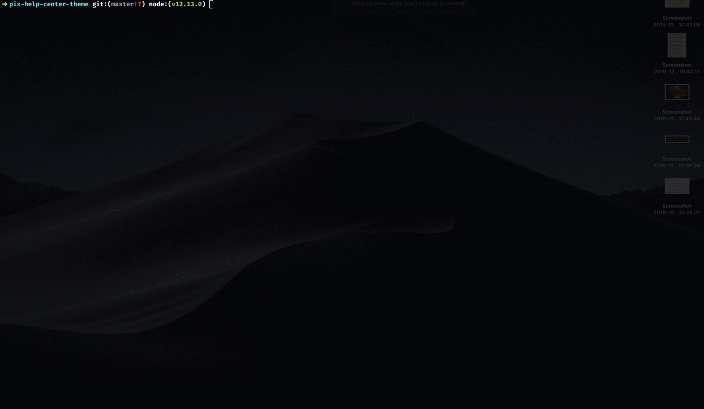

# pix-help-center-theme

Ce dépôt contient les styles de notre site de support ([support.pix.fr](support.pix.fr)) géré dans [freshdesk](www.freshdesk.fr).

# Déployer une nouvelle version

Freshdesk ne proposant qu'une interface de saisie, pour déployer une nouvelle version des styles, il faut passer par des copier / coller.

[Une image valant mille mots](https://fr.wiktionary.org/wiki/une_image_vaut_mille_mots), le gif suivant montre le process complet.


1. Installer les dépendances

	```sh
	$ npm install
	```

1. Générer le css depuis le scss (le contenu de la feuille de style est directement copié dans le presse-papier)

	```sh
	$ npm run build
	```

1. Se connecter avec le compte `dev+support@pix.fr` (disponible dans KeePassX, section `Customer Service/Ticketing`)
	
	Dans `Admin/Portails`, choisir `Personnaliser le portail` puis `Feuille de style`.
	Coller la nouvelle version de la feuille de style dans le champ `Feuille de style personnalisée`.
1. Se connecter avec le compte de support pour les développeurs (disponible dans KeePassX, section `Customer Service/Ticketing`)

1. Publier la nouvelle version en cliquant sur `Enregistrer et publier`

